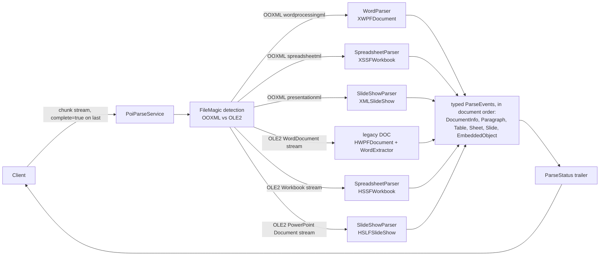

# grPOIc

A gRPC server that wraps [Apache POI](https://poi.apache.org/). Clients stream
office document bytes in and receive typed structure events back: metadata,
paragraphs, tables, sheets, slides, embedded objects, and a final status.

The server exists for two reasons:

1. POI is a library, not a service. Putting it behind gRPC gives non-JVM
   clients access to office parsing over a stable wire contract, and isolates
   parser crashes and memory use in a separate process.
2. Document bytes should not touch disk. The whole parse happens in memory:
   no temp files, no subprocesses. The container runs with a read-only root
   filesystem.

grPOIc extracts content and metadata. It does not render or convert
documents.



## Wire API

`ai.pipestream.poi.v1.PoiParseService`, defined in
[`grpoic-api/src/main/proto/ai/pipestream/poi/v1`](grpoic-api/src/main/proto/ai/pipestream/poi/v1):

```text
rpc ParseDocument(stream ParseRequestChunk) returns (stream ParseEvent);
rpc GetServiceInfo(GetServiceInfoRequest) returns (GetServiceInfoResponse);
```

**Request.** `ParseRequestChunk` messages carry `document_id` and advisory
`filename` / `content_type` (read from the first chunk; the server detects
the real format from the bytes and never trusts these), plus a `data` slice
and a `complete` flag on the last chunk. A single-chunk upload (all bytes
plus `complete=true`) is the common case.

**Response.** A `ParseEvent` per event, `oneof event`:

| Event | When | Carries |
|---|---|---|
| `DocumentInfo` | first, once | `document_id`, detected `DocumentFormat`, typed `DocumentMetadata` |
| `Paragraph` | body text, in document order | `text`, the document's style name (`Heading1`, `Normal`, ...) |
| `Table` | one body table | rows of `TableCell` (text, `row_span`, `col_span`; merged regions, vertical merges included, carry the spans on the anchor cell only and covered positions are not repeated; a row that starts late or ends early gets one empty cell spanning the gap; spans are clamped to 1024) |
| `Sheet` | one worksheet, streamed as a unit | `index`, `name`, populated `SheetRow`s of typed `SheetCell`s (string/double/boolean/date storage type, plus formula source and cached result for formula cells; empty rows are skipped) |
| `Slide` | one presentation slide | `index`, `title`, remaining text frames as `texts`, speaker `notes` |
| `EmbeddedObject` | one embedded part the document carries | `id`, `filename`, `content_type`, `size_bytes` (descriptor only; bytes are not streamed in v1) |
| `ParseStatus` | last, exactly once | `state` (`STATE_OK` / `STATE_PARTIAL`), human-readable `warnings`, and per-kind counts (`paragraphs`, `tables`, `sheets`, `slides`, `embedded_objects`) |

Formats: DOCX, XLSX, PPTX and the OLE2 legacy trio DOC, XLS, PPT. The format
is detected from the bytes; the advisory content type is never trusted.
Spreadsheet cells keep their storage types (string, double, boolean, date).
Formula cells carry the formula source plus the cached result; formulas are
never evaluated. Metadata is typed and lossless: well-known core properties as
first-class fields (`title`, `author`, `last_modified_by`, `created`,
`modified`), everything else in a tagged `tail`, nothing guessed from string
shapes.

`GetServiceInfo` reports `service_version`, `poi_version` (the running Apache
POI library version), `api_version`, `supported_formats`, and the two limits
below, for orchestrators and tool facades that need capability discovery. Its
`ui` field is the shared `UiInfo` advertisement the demo shell reads to build
its tab bar.

**Errors** are gRPC status codes: `INVALID_ARGUMENT` (no bytes, stream ended
without a chunk marked `complete`, unreadable claimed format),
`RESOURCE_EXHAUSTED` (over the byte cap), `UNIMPLEMENTED` (bytes are not an
office format this server parses), `INTERNAL` (parser fault). Standard gRPC
health checking (`grpc.health.v1.Health`) and reflection (v1 and v1alpha) are
registered:

```bash
grpcurl -plaintext localhost:50052 list
grpcurl -plaintext localhost:50052 ai.pipestream.poi.v1.PoiParseService/GetServiceInfo
grpcurl -plaintext localhost:50052 grpc.health.v1.Health/Check
```

## Concurrency model

POI documents are single-threaded; distinct documents on distinct threads is
the supported pattern. Each parse runs on its own virtual thread, with a
semaphore bounding concurrent parses. The bound protects heap (POI holds full
document models in memory), not just CPU.

## Configuration

| Variable | Default | Meaning |
|---|---|---|
| `GRPOIC_PORT` | `50052` | Listen port |
| `GRPOIC_MAX_DOCUMENT_MIB` | `70` | Per-document byte cap (`RESOURCE_EXHAUSTED` above it) |
| `GRPOIC_MAX_CONCURRENT_PARSES` | max(2, CPU cores) | Parses in flight before queueing |
| `GRPOIC_METRICS_INTERVAL_SECONDS` | `60` | Metrics line interval, `0` disables |

Metrics are a stdout line on that interval: `grPOIc metrics:
docs{parsed=N,rejected=N,failed=N}`.

## Build and test

```bash
./gradlew build          # compiles grpoic-api and grpoic-service, and runs the test suite
./gradlew test           # test suite only
./gradlew :grpoic-service:run    # listens on 0.0.0.0:50052
```

Tests author their fixtures with POI itself, in memory. No binary files are
committed, and every assertion is against content the test placed.

## Docker

The published image is `pipestreamai/grpoic:latest`:

```bash
docker pull pipestreamai/grpoic:latest
docker run --rm --read-only -p 50052:50052 pipestreamai/grpoic:latest
```

Building locally runs the same multi-stage build (compile, run the full test
suite, assemble the distribution, then a JRE-only runtime layer as a
non-root user):

```bash
docker build -t grpoic .
docker run --rm --read-only -p 50052:50052 grpoic
```

The image build runs the full test suite, so an image never ships from a
tree whose tests did not pass. `--read-only` works because the server never
writes to disk.
